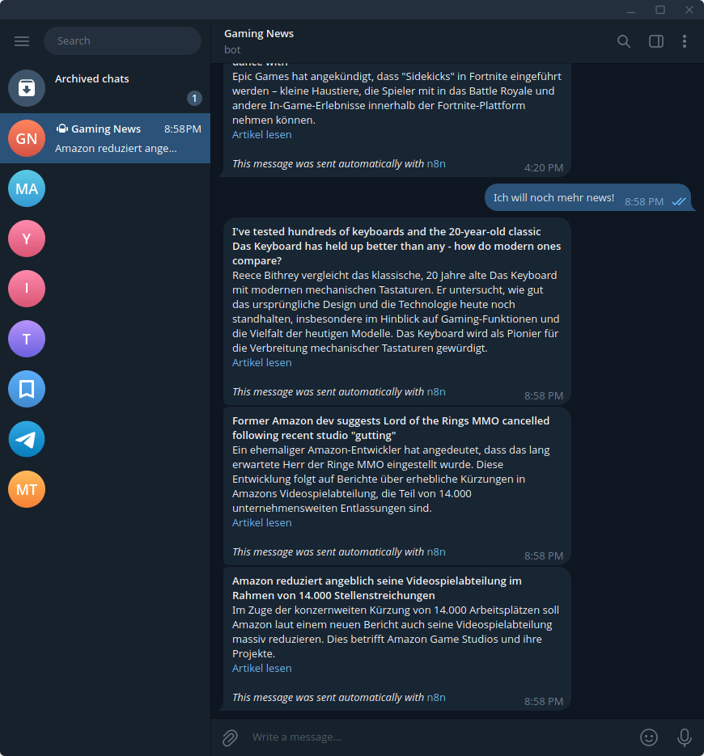

# 🎮 Gaming News Telegram Bot

An intelligent n8n workflow that connects to a Telegram bot to fetch, filter, summarize, and deliver the latest gaming news — powered by AI.  
The workflow automatically detects and filters out sponsored or promotional articles, so you only get real, unbiased content.

## 🚀 Features
- 💬 **Telegram Bot integration** – chat with the bot to request gaming news  
- 🌐 **News fetching** – retrieves articles from predefined gaming news sources  
- 🚫 **AI ad filtering** – automatically detects and removes sponsored or promotional content 
- 🧠 **AI summarization** – condenses each article into short summaries   
- 📤 **Instant delivery** – sends the final summaries directly back to Telegram

## 🧠 Tech Stack
- [n8n](https://n8n.io/) – workflow automation  
- Telegram Bot API  
- Google Gemini for summarization and ad detection  
- HTTP Request nodes (fetching news from fixed URLs)
  
## ⚙️ Usage
1. You send a message to the Telegram bot (e.g. "Find new articles")
2. The Telegram Trigger node in n8n starts the workflow
3. The workflow retrieves articles from predefined gaming news URLs (PC Gamer, GameStar, ...)
4. An AI node analyzes the text, removes promotional or sponsored content, and summarizes the rest
5. The summarized results are sent back to you on Telegram

## 💬 Telegram Chat Examples

  
  

## 🧩 Workflow Structure

  

