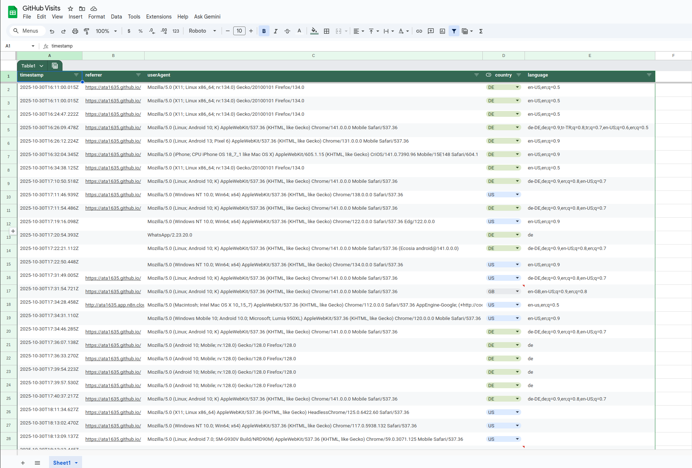
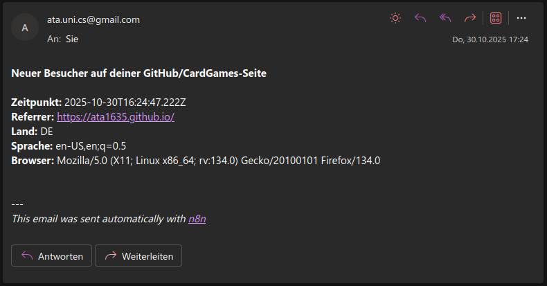
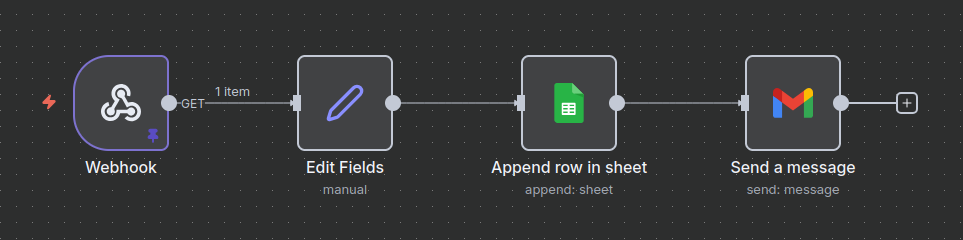

# 📊 GitHub Visitors Tracker

An n8n workflow that automatically logs visits to my GitHub Pages project using an HTTP Webhook.  
Each incoming request is recorded in Google Sheets, and an email notification is sent — fully automated.

## 🚀 Features
- 🪝 **Webhook Trigger** – activated whenever a request from my Card Games [github.io](https://github.com/ata1635/CardGames) page is received  
- 📄 **Google Sheets logging** – stores timestamp, referrer, user agent, country and language  
- 📧 **Email notifications** – instantly sends visitor details  
- 🤖 **Automation with n8n** – no manual work required

## 🧠 Tech Stack
- [n8n](https://n8n.io/) – workflow automation  
- Google Sheets API  
- Gmail API for email sending  
- HTTP Webhook Trigger node

## ⚙️ How It Works
1. A visitor loads my [GitHub Pages](https://ata1635.github.io/CardGames/) site.  
2. The site contains a small HTML snippet that makes a request to the n8n webhook.  
3. The n8n HTTP Webhook Trigger receives the request and extracts metadata.  
4. The workflow logs the information into a Google Sheet.  
5. Finally, an email summary of the visit is sent automatically.

## 🔗 Webhook Integration

The workflow is triggered via an HTTP Webhook embedded in another project:  
➡️ [View implementation in CardGames index.html (line 180)](https://github.com/ata1635/CardGames/blob/main/index.html#L180)

```html

```

## 📊 Google Sheets Example
<p align="center">
  
</p>

## 📧 Email Example
<p align="center">
  
</p>

## 🧩 Workflow Structure
<p align="center">
  
</p>
